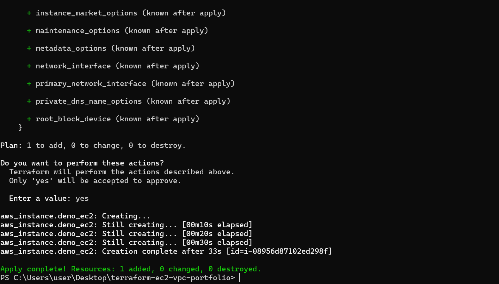
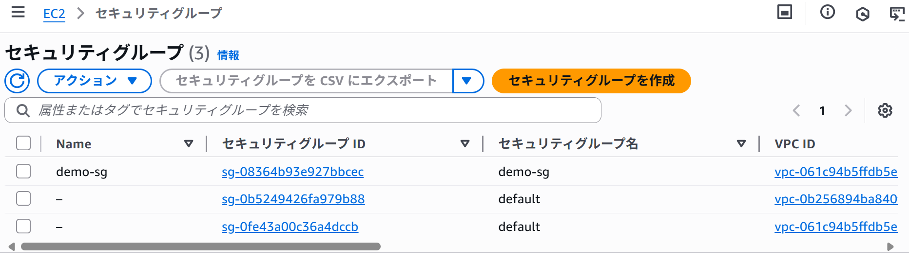
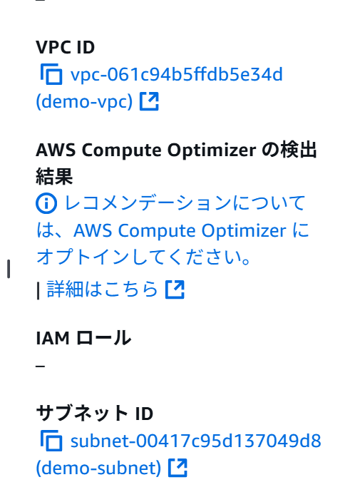
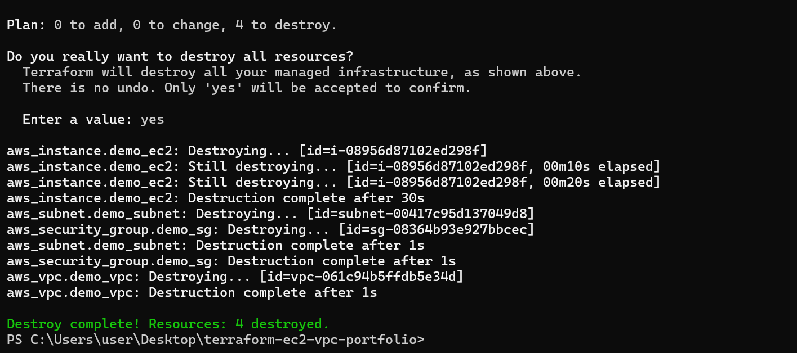

# Terraformで構築するAWS EC2ポートフォリオ

## 概要
このプロジェクトは、Terraformを使用してAWS上にEC2インスタンスを自動構築するデモです。  
VPC、サブネット、セキュリティグループ、EC2インスタンスをすべてコードで管理しています。

---

## 技術スタック
- **Terraform**
- **AWS CLI**
- **PowerShell**

---

## デモ手順

### 1️⃣ Terraformで環境を作成 (`terraform apply`)
Terraformを使用してAWS上にEC2インスタンスを自動構築しました。

---

### 2️⃣ セキュリティグループの確認
Terraformで作成されたセキュリティグループの設定を確認。  
22番ポート（SSH）を開放していることがわかります。

---

### 3️⃣ VPC・サブネットの確認
Terraformで自動作成されたVPCとサブネットの構成を確認。

---

### 4️⃣ AWSコンソールでのEC2詳細
作成したEC2インスタンスの詳細をAWSコンソールで確認。  
VPC IDやPublic IP、セキュリティグループの関連付けを確認できます。

---

### 5️⃣ Terraformで削除 (`terraform destroy`)
不要になったAWSリソースを削除し、コストを回避。

---

## Terraformコードのポイント
- `provider "aws"` : AWSの認証情報とリージョンを指定  
- `resource "aws_vpc"` : VPCを作成  
- `resource "aws_subnet"` : サブネットを定義  
- `resource "aws_security_group"` : SSH接続（22番ポート）を許可  
- `resource "aws_instance"` : EC2インスタンスを作成  

---

## 学んだこと
- TerraformでのInfrastructure as Code (IaC) 実践  
- AWSリソースの自動構築と削除の流れ  
- VPC・サブネット・セキュリティグループの関連理解  
- GitHubで成果物を整理しポートフォリオ化する方法  

---

## 今後の展望
次のステップとして、Auto Scaling や Lambda、S3連携をTerraformで自動化し、  
より本番環境に近い構成を目指します。
